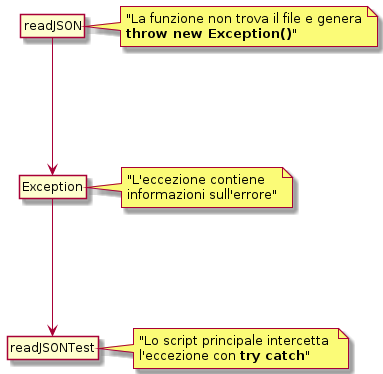

# Modulo di PHP

## Creazione del repository

Se avete un repository locale e lo volete collegare a un repostitory in remoto già esistente (github).

Nel mio caso:

> url repository:
> <https://github.com/corsidrive/formarete-2020-21-linguaggio-di--programmazione-php>.

Quindi:

```bash

git remote add origin https://github.com/corsidrive/formarete-2020-21-linguaggio-di--programmazione-php.git
git branch -M main
git push -u origin main

```

### String

<https://www.php.net/manual/en/ref.strings.php>

### Array

[array su w3school](https://www.w3schools.com/php/php_arrays.asp)

[array su tutorialspoint](https://www.tutorialspoint.com/php/php_arrays.htm)

### Iterazione di array

**paradigma imperativo**

- ciclo for
- ciclo foreach

**paradigma dichiarativo**

- array_map (trasforma un array)
- array_filter (filtra un array)

[Ricerca di un valore in un array (imperativo)](array_basic/array_functions.php)
[Esempi di stile dichiarativo](array_basic/extractNamesMap_declarative_programming.php)
[Esempi di stile imperativo](array_basic/extractNames_foreach_imperative_programming.php)

### Espressioni regolari

Le Regex sono un metodo utilizzato in molti linguaggi di programmazione (compresi PHP e Javascript) per controllare la corretta sintassi o per manipolare le stringhe.

[Sito che permette di testare le *reg expression*](https://regex101.com/r/powozc/1)
[funzioni di PHP che usano le espressioni regolari](https://www.php.net/manual/en/ref.pcre.php)

Noi abbiamo usato
[preg_replace](https://www.php.net/manual/en/function.preg-replace.php)
Per togliere le cifre dai nomi in [sanitizeName](./case_study/sanitizeName/sanitizeName.php).

### PHP filter functions  per Validare e Sanificare id dati

funzioni native del linguaggio che permettono di controllare, validare e ripulire i dati contenuti all’ interno di variabili e argomenti.

<https://www.php.net/manual/en/function.strip-tags.php>
<https://www.php.net/manual/en/function.filter-var.php>

che utilizza i filtri

<https://www.php.net/manual/en/filter.filters.php>

[Utilizzato in sanitizeName](case_study/sanitizeName/sanitizeName.php)

## Lezione del 1 Marzo

### Funzione ReadJSON

creazione dei test per la funzione che apre un file formato <a href="https://www.html.it/articoli/introduzione-a-json/" target="_blank">JSON</a>
e lo converte in un array associativo.

#### readJSONTest

[Codice di readJSONTest.php](case_study/tasklistArray/lib/JSONReaderTest.php)

##### Casi positivi

- [x] apertura di un file con un array di 20 item
- [x] [apertura di un file con un array vuoto](/case_study/tasklistArray/dataset/TaskList-zero.json)

##### Errori da gestire

- [x] errore di file non esistente
- [ ] errore di file esistente ma di formato non corretto (ancora da implementare)


#### Exception

##### La gestione degli errori in PHP.



Nella documentazione di PHP c'è l'esempio della funzione **inverse**
che genera l'eccezione **Division by zero**
[esempio di Exception](https://www.php.net/manual/en/language.exceptions.php)

Articoli da leggere

- [Gestione delle eccezioni in PHP con try e catch](https://www.mrw.it/php/gestione-eccezioni-php_7007.html)


#### testTools

creazione di una serie di strumenti che ci aiutino a visualizzare 
in modo più semplice e ordinato l'esito dei test.

[testTools.php](vendor/testTools/testTool.php)
[assertEquals()](vendor/testTools/testTool.php)